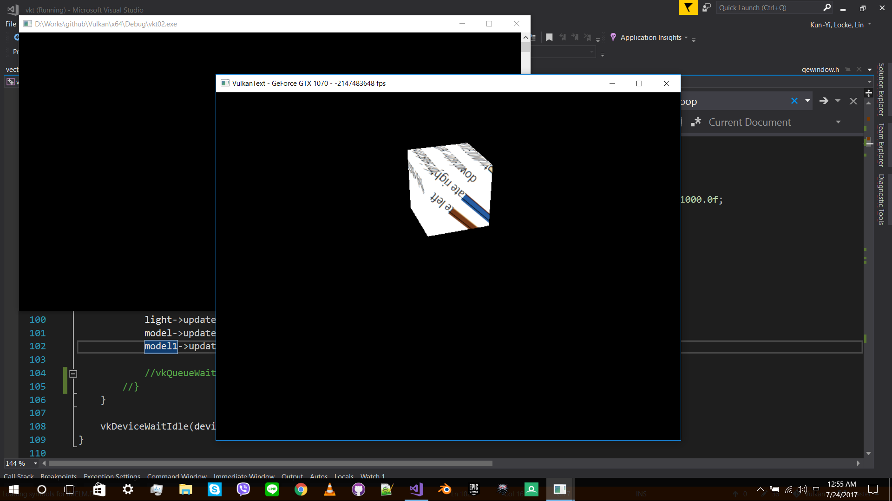
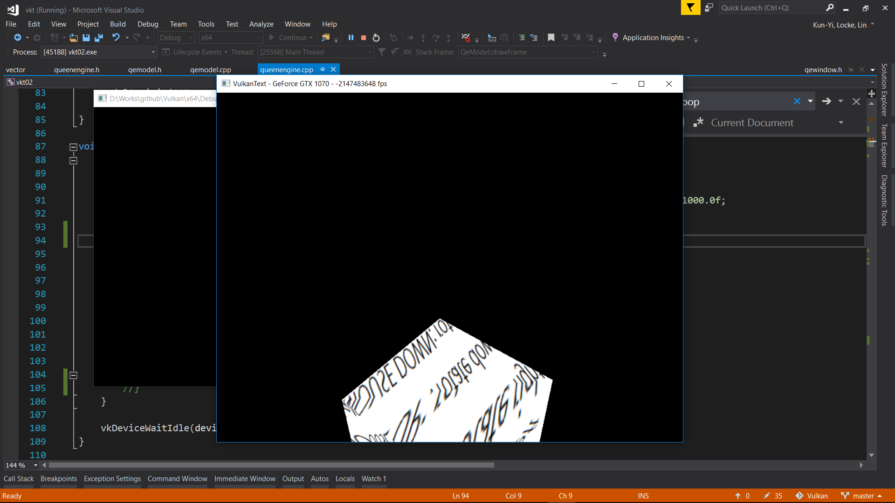

# Vulkan

reference: https://vulkan-tutorial.com/ & https://github.com/SaschaWillems/Vulkan & https://renderdoc.org/ & https://github.com/PacktPublishing/Vulkan-Cookbook

--------------------------
I meet a problem. I try to draw two same boxes in different position. But the two boxes keep flashing. The screen cannot show the two boxes at the same time.  

--------------------------
class QeModel;
-------------------------
The two boxes use the same

VkBuffer vertexBuffer;

VkBuffer indexBuffer;

VkDeviceMemory vertexBufferMemory;

VkDeviceMemory indexBufferMemory;

VkImage textureImage;

VkDeviceMemory textureImageMemory;

VkImageView textureImageView;

VkSampler textureSampler;

VkShaderModule shader;

---------------------
And they have their own 

VkPipelineLayout pipelineLayout;

VkDescriptorSet descriptorSet;

VkBuffer uniformBuffer;

VkDeviceMemory uniformBufferMemory;

std::vector<VkCommandBuffer> commandBuffers;

VkPipeline graphicsPipeline;

VkDescriptorSetLayout descriptorSetLayout;

VkDescriptorPool descriptorPool;

